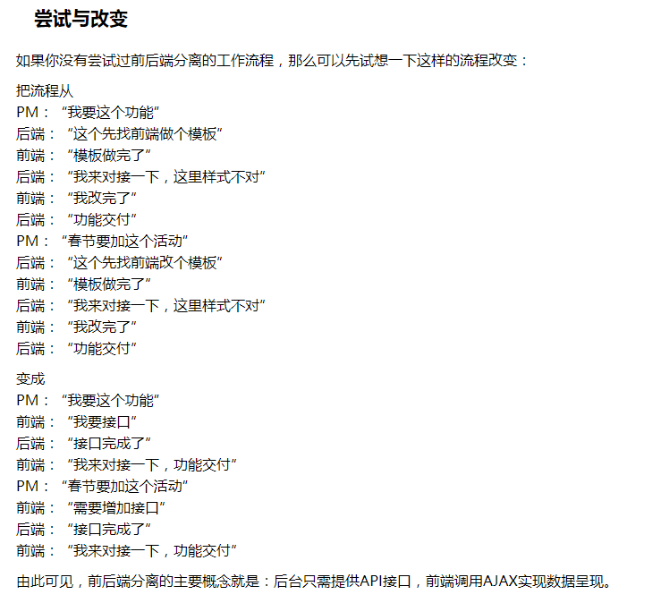

# vue-system

##技术点
* [webpack](https://doc.webpack-china.org/)  ———— JS 应用程序的模块打包器
* [vue](https://cn.vuejs.org/) ———— 渐进式 JS（MVC） 框架
* [iview](https://www.iviewui.com/) ———— 基于 Vue 的开源 UI 组件库
* [vuex](https://vuex.vuejs.org/zh-cn/intro.html) ———— Vue 应用程序开发的状态管理模式
* [axios](https://www.kancloud.cn/yunye/axios/234845) ———— 基于 Promise 用于浏览器和 nodejs 的 HTTP 客户端

## 登录
在路由中做登录拦截，对token进行验证，根据存在与否，判断是否需要再次登录

* 登录成功，账号密码正确，返回code（200）和token
* 登录错误，返回对应code和massage（错误原因）

账号：one / two  
密码：123456